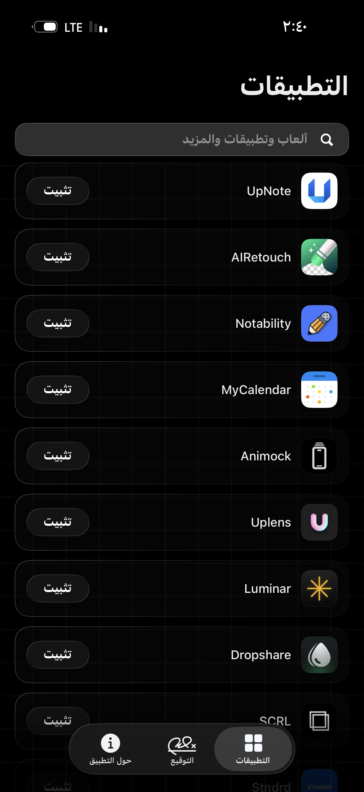
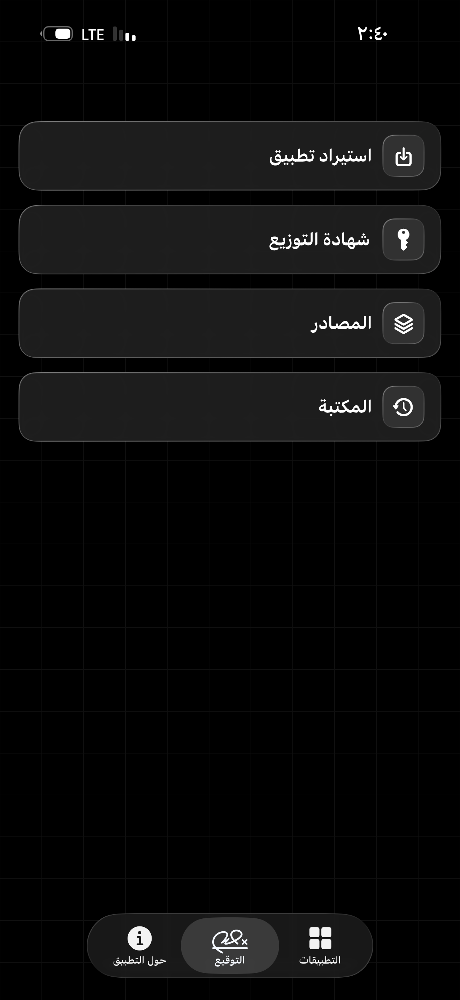
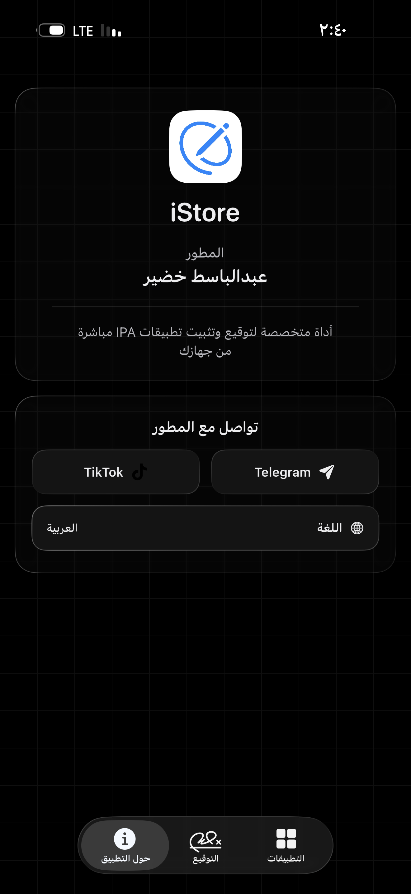

# iStore

> تطبيق iOS مفتوح المصدر لتوقيع وتثبيت ملفات IPA محلياً على iPhone وiPad.

**iStore** هو تطبيق مكتوب بـ SwiftUI يتيح استيراد ملفات IPA أو تنزيلها من المصادر المضافة، ثم توقيعها على الجهاز باستخدام شهادة `P12` وملف `mobileprovision` خاصين بالمستخدم. صُمم التطبيق بواجهة عربية افتراضية، وتجربة Liquid Glass خفيفة وسلسة، من دون رفع ملفات الشهادات أو التطبيقات إلى خادم خارجي.

## المزايا

- **توقيع محلي** لملفات IPA باستخدام شهادة `P12` وملف Provisioning Profile خاصين بك.
- **تثبيت بعد التوقيع** مع حالات واضحة للتنزيل والتوقيع والتثبيت ومعالجة للأخطاء والتعليق.
- **مصادر تطبيقات** لتصفح التطبيقات وتنزيلها ثم تمريرها لمسار التوقيع داخل iStore.
- **مكتبة محلية** للاحتفاظ بالتطبيقات التي وقعتها، مع خيارات المشاركة والحذف وإعادة التثبيت.
- **استيراد IPA** من تطبيق الملفات واختيار أيقونة بديلة أو إضافة Dylib متوافق عند الحاجة.
- **واجهة Liquid Glass** أصلية على iOS 26، مع بديل Material خفيف ومتوافق مع الإصدارات الأقدم.
- **العربية افتراضياً** مع اتجاه RTL صحيح، ودعم اللغة الإنكليزية عند الحاجة.
- **أداء محسّن** للقوائم والبحث وحالات زر التثبيت لتقليل التقطيع والتحديثات غير الضرورية.

## لقطات من التطبيق

| التطبيقات | التوقيع | حول التطبيق |
| --- | --- | --- |
|  |  |  |

## التوافق

| العنصر | التفاصيل |
| --- | --- |
| الحد الأدنى للنظام | iOS 16.4 |
| اللغة | Swift 6 وSwiftUI |
| واجهة Liquid Glass الأصلية | iOS 26 وما بعده |
| الواجهة البديلة | Material على iOS 16.4 إلى iOS 25 |
| محرك التوقيع | zsign المضمّن داخل المشروع |

## البناء من المصدر

يتطلب البناء Xcode حديثاً يدعم iOS 26 SDK لتجربة Liquid Glass الأصلية، بالإضافة إلى [XcodeGen](https://github.com/yonaskolb/XcodeGen).

```bash
xcodegen generate
open ForgeSignMobile.xcodeproj
```

افتح المشروع في Xcode وابنِ Scheme باسم `ForgeSignMobile`. اسم التطبيق الناتج للمستخدم هو **iStore**. إعدادات التوقيع داخل المشروع معطلة افتراضياً؛ وقّع التطبيق الناتج بشهادتك وملف Provisioning Profile المناسبين قبل تثبيته على جهازك.

## الاستخدام المسؤول

iStore أداة محلية لإدارة ملفات IPA التي تملك حق استخدامها أو تعديلها. أنت مسؤول عن شهاداتك وملفات التوقيع والتطبيقات التي تستوردها أو تثبتها.

لا ترفع ملفات `P12` أو كلمات مرورها أو ملفات Provisioning Profile إلى Issues أو إلى أي مكان عام داخل GitHub.

## المساهمة والدعم

إذا وجدت خللاً أو لديك اقتراح لتحسين الأداء أو الواجهة، افتح [Issue](https://github.com/hggdet/iStore-iOS/issues) واضحاً يتضمن إصدار iOS، نوع الجهاز، والخطوات التي أدت إلى المشكلة.

إذا عجبك المشروع، ادعمه بوضع **Star** على GitHub ومشاركته مع من قد يستفيد منه.

## الرخصة

كود iStore الأصلي متاح تحت [رخصة MIT](LICENSE)، وحقوق النشر محفوظة لـ **Abdulbasit Khudair © 2026**.

يحتوي المشروع على مكونات خارجية تحتفظ بتراخيصها الخاصة، منها zsign وOpenSSL. راجع [THIRD_PARTY_NOTICES.md](THIRD_PARTY_NOTICES.md) للتفاصيل.
